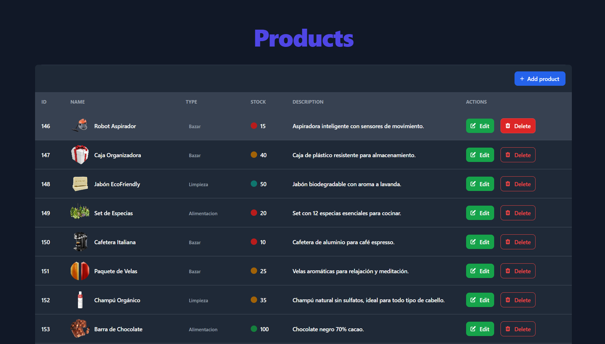
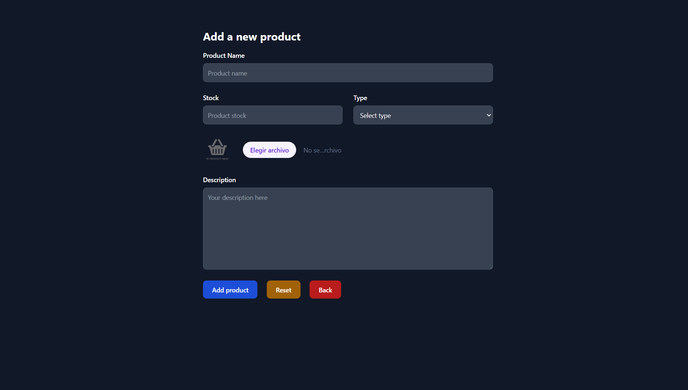
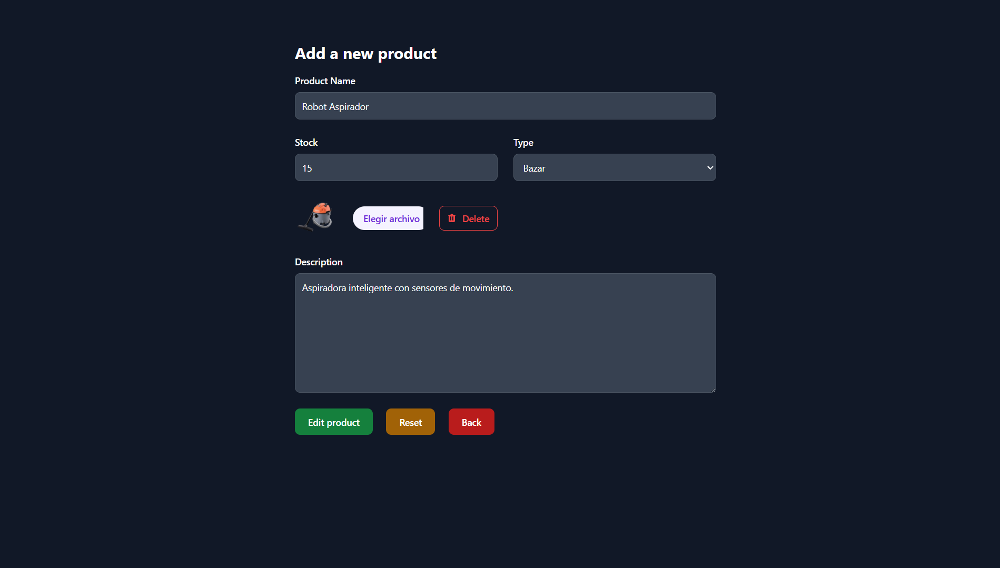
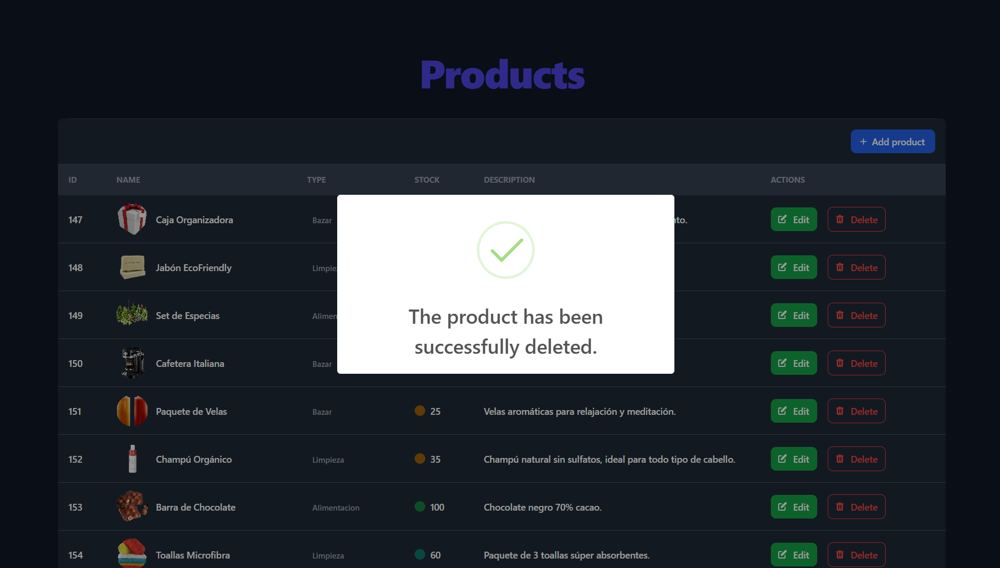

# CRUD Products

Bienvenido a **CRUD_Products**, un proyecto que implementa un sistema básico de gestión de productos utilizando [PHP](https://www.php.net/), [MySQL](https://www.mysql.com/), y una interfaz responsive desarrollada con [Tailwind CSS](https://tailwindcss.com/).

## Características principales

- **Crear**: Permite agregar nuevos productos con título, contenido y etiquetas.
- **Leer**: Visualiza una lista de productos con detalles completos.
- **Actualizar**: Edita productos existentes de forma sencilla.
- **Eliminar**: Elimina productos que ya no son necesarios.
- **Interfaz amigable**: UI moderna y responsiva gracias a Tailwind CSS.

## Tecnologías utilizadas

- **Backend**: PHP 8+.
- **Frontend**: HTML5, Tailwind CSS.
- **Base de datos**: MySQL.
- **Servidor local**: XAMPP.
- **Herramientas adicionales**: Visual Studio Code.

## Estructura del proyecto

```
CRUD_Products/
├── database/
│   ├── tables.sql           # Esquema de las tablas de la base de datos
├── public/
│   ├── img/                 # Directorio donde se almacenan las imágenes de los productos
│   ├── screenshots/         # Capturas de pantalla del proyecto
│   ├── delete.php           # Página para eliminar un producto
│   ├── new.php              # Página para crear un nuevo producto
│   ├── products.php         # Página con la lista de productos
│   ├── update.php           # Página para actualizar un producto
├── scripts/
│   ├── script.php           # Script para generar productos de prueba
├── src/
│   ├── Database/
│   │   ├── Connection.php    # Clase para manejar la conexión a la base de datos
│   │   ├── Product.php       # Clase para gestionar productos
│   │   ├── QueryExecutor.php # Clase para ejecutar consultas SQL
│   ├── Utils/
│       ├── AlertNotifier.php        # Clase para mostrar mensajes de estado con SweetAlert2
│       ├── ErrorHandler.php         # Clase para gestionar y mostrar errores en los formularios
│       ├── ImageConstants.php       # Constantes relacionadas con imágenes
│       ├── ImageProcessor.php       # Clase para procesar imágenes
│       ├── InputValidator.php       # Clase para validar entradas
│       ├── Navigation.php           # Clase para gestionar navegación del sistema
│       ├── ProductInputValidator.php# Validación específica de entradas para productos
│       ├── TypeProduct.php          # Clase para manejar tipos de productos
├── .env                     # Variables de entorno del proyecto
├── README.md                # Documentación del proyecto
├── LICENSE                  # Licencia MIT
```

## Instalación y configuración

1. Clona este repositorio:
   ```bash
   git clone https://github.com/Omatple/CRUD_Products.git
   ```

2. Configura tu entorno local:
   - Descarga e instala [XAMPP](https://www.apachefriends.org/).
   - Crea una base de datos en MySQL e importa el archivo `tables.sql`.

3. Configura el archivo `.env` con tus credenciales de base de datos:
   ```env
   PORT=3306
   HOST=localhost
   DBNAME=crud_products
   USER=root
   PASSWORD=tu_password
   ```

4. Inicia el servidor local:
   - Coloca el proyecto en la carpeta `htdocs` de XAMPP.
   - Accede a [http://localhost/CRUD_Products](http://localhost/CRUD_Products).

## Capturas de pantalla

### Página principal y formulario de creación
| Página principal               | Formulario de creación           |
|--------------------------------|-----------------------------------|
|  |  |

### Formulario de actualización y mensajes de estado
| Formulario de actualización     | Mensajes de estado              |
|---------------------------------|----------------------------------|
|  |  |

## Cómo contribuir

1. Haz un fork del repositorio.
2. Crea una nueva rama:
   ```bash
   git checkout -b feature/new-feature
   ```
3. Realiza los cambios y haz un commit:
   ```bash
   git commit -m "Agregada nueva funcionalidad"
   ```
4. Envía un pull request.

## Licencia

Este proyecto está licenciado bajo la [MIT License](LICENSE).

## Contacto

¿Tienes preguntas o sugerencias? ¡Házmelo saber!  
**Ángel Martínez Otero** - [LinkedIn](https://linkedin.com/in/Omatple)  
